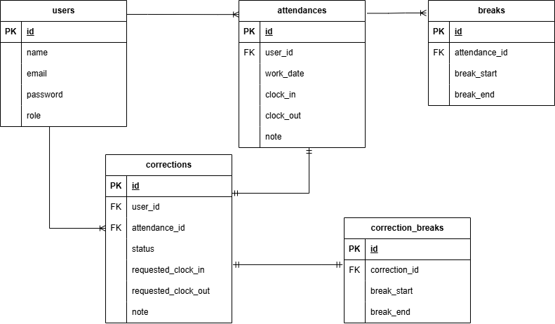

# laravel-docker-template
## 環境構築
### Dockerビルド
・git clone git@github.com:Estra-Coachtech/laravel-docker-template.git  
・mv laravel-docker-template flea-market-app  
・cd flea-market-app  
・git remote set-url origin git@github.com:fujiurin/flea-market-app.git  
・git remote -v  
・git add .  
・git commit -m "リモートリポジトリの変更"  
・git push origin main  
・docker-compose up -d --build  

### Laravel環境構築
・docker-compose exec php bash  
・composer install  
・cp .env.example .env  
・.envを以下に変更
```env
DB_CONNECTION=mysql
DB_HOST=mysql
DB_PORT=3306
DB_DATABASE=laravel_db
DB_USERNAME=laravel_user
DB_PASSWORD=laravel_pass
```
### アプリケーションキーの作成
・php artisan key:generate

### マイグレーションの実行
・php artisan migrate

### シーディングの実行
・php artisan db:seed

## 使用技術
・PHP 8.4.13  
・MySQL 8.0.26　
・Laravel 8.83.29 

## URL
・開発環境：http://localhost/  
・phpMyAdmin：http://localhost:8080/  
・mailhog：http://localhost:8025/  

## ER図 


## 単体テスト
・mysql -u root -p  
・> CREATE DATABASE demo_test;  
・> SHOW DATABASES;  
・database.phpを以下に変更  
```database.php  
'mysql_test' => [
             'driver' => 'mysql',
             'url' => env('DATABASE_URL'),
             'host' => env('DB_HOST', '127.0.0.1'),
             'port' => env('DB_PORT', '3306'),
             'database' => 'demo_test',
             'username' => 'root',
             'password' => 'root',
             'unix_socket' => env('DB_SOCKET', ''),
             'charset' => 'utf8mb4',
             'collation' => 'utf8mb4_unicode_ci',
             'prefix' => '',
             'prefix_indexes' => true,
             'strict' => true,
             'engine' => null,
             'options' => extension_loaded('pdo_mysql') ? array_filter([
                 PDO::MYSQL_ATTR_SSL_CA => env('MYSQL_ATTR_SSL_CA'),
             ]) : [],
],
```
・テスト用.envファイル作成　cp .env .env.testing
```.env.testing
　APP_NAME=Laravel
- APP_ENV=local
- APP_KEY=base64:vPtYQu63T1fmcyeBgEPd0fJ+jvmnzjYMaUf7d5iuB+c=
+ APP_ENV=test
+ APP_KEY=
　APP_DEBUG=true
　APP_URL=http://localhost

  DB_CONNECTION=mysql_test
  DB_HOST=mysql
  DB_PORT=3306
- DB_DATABASE=laravel_db
- DB_USERNAME=laravel_user
- DB_PASSWORD=laravel_pass
+ DB_DATABASE=demo_test
+ DB_USERNAME=root
+ DB_PASSWORD=root
```
・テスト用のアプリケーションキー作成 php artisan key:generate --env=testing  
・php artisan config:clear  
・php artisan migrate --env=testing  
・phpunitの編集  
```phpunit.xml 
-         <!-- <server name="DB_CONNECTION" value="sqlite"/> -->
-         <!-- <server name="DB_DATABASE" value=":memory:"/> -->
+         <server name="DB_CONNECTION" value="mysql_test"/>
+         <server name="DB_DATABASE" value="demo_test"/>
```
・テストファイルの作成  
AdminAttendanceTest.php  
AdminAuthTest.php  
AdminCorrectionTest.php  
AdminStaffTest.php  
UserAttendanceTest.php  
UserAuthTest.php  
UserCorrectionTest.php  
・テスト実行　php artisan test

## テストケース、日時取得機能について
日時はJavaScriptの `Date` オブジェクトを用いて取得し、
画面上にリアルタイムで表示している。
そのため本項目はバックエンドの単体テストではなく、
UI表示確認（ブラウザテスト）にて動作確認を実施している。
